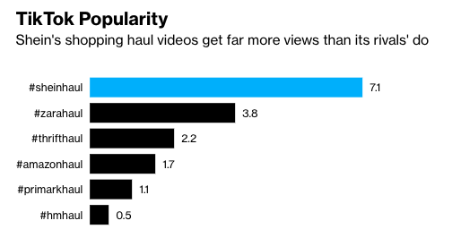

```{r setup, include=FALSE}
knitr::opts_chunk$set(echo = TRUE)
```

## Introduction

1.  Perform a Scenario Design analysis that helps make sure to take UX (user experience) into account. Consider whether it makes sense for your selected recommender system to perform scenario design twice, once for the organization (e.g. Amazon.com) and once for the organization's customers.
2.  Attempt to reverse engineer what you can about the site, from the site interface and any available information that you can find on the Internet or elsewhere.
3.  Include specific recommendations about how to improve the site's recommendation capabilities going forward.
4.  Create your report using an R Markdown file, and create a discussion thread with a link to the GitHub repo where your Markdown file notebook resides. You are not expected to need to write code for this discussion assignment.

## Scenario Design {.tabset}

**Target Users**

-   Shein targets any users who want to acquire current fashion styles, however their primary audience are teenagers to young adults.

**Key Goals**

-   Minimize delays between fashion trend to customer's hand
-   Low cost barrier for purchasing clothing
-   Recommend alternative options to their users' searches on their website.

**How to Help Users Accomplish Key Goals**

-   Clothing goes from drawing board to shipping container within ten (10) days.
-   Average prices for clothing items is about the cost of a sandwich to a fast food retail meal.

## Reverse Engineer

What Shein reproduces when fulfilling their targets' desires is astonishing at scale.

-   "Every single day, Shein updates its website with, on average, 6,000 new styles --- an outrageous figure even in the context of fast fashion."
-   "The company's data collection goes way beyond sales trends, though. It monitors social media for viral looks that can be quickly copied, tracks users' browsing history and keeps tabs on reviews and fashion events. A customer might see their favorite celebrity on TikTok in a puff-sleeve blouse or drop-shoulder dress, then within days be offered a near-identical style on Shein's website, thanks to a powerful recommendations algorithm that analyzes users' profiles, online habits and historical data."

How it directly influences social media is intriguing to their recommendation system. Comparing fast fashion trends on Tik Tok, Shein outperforms its competitors by far. This partnership is paired with giving social media influencers free clothing to try on, disclose to their viewers what their opinions are on the style, and then offering personalized discount codes to shop on the website. In turn, this provides revenue to the company but also provides the influencer commission on the sales. 

{width="385"}

It also reduces long term warehouse storage of clothing because it does small batch ordering with their vendors. This means as an item continues to be popular, it will reorder more from them, however once sales drop enough, their algorithm will halt production. 

Browsing Shein's website, you are immediately bombarded with discount or coupon codes you have to click away. This is not just once, but three separate instances as you close them away. But wait, even as you close those pesky pop-ups its main banner promotes more codes for savings when your order meets certain thresholds. From my perspective, it definitely feels like a Las Vegas or Atlantic City casino where it is trying to get you to stay longer and spend a few dollars. 

## Recommendations for Improvement

Shein has developed a reputation for how its clothing has become more of a long term sustainability problem, given how fast people can buy clothing they will not use it just months after. Given how long certain products may continue to sell, and not taper off and while as browsing through the website, they offer a clothing exchange program to earn money back on your older clothing, Shein has an opportunity to change their recommendations to be more eco-conscious. If the company is able to determine what clothes they have purchased previously, and are currently looking to buy something different, it could possibly offer customers discounts for repurchasing their old clothing as they shop. It is similar to the buying habits of purchasing  new cell phone and when you trade in an older device, you get money back for your new one. 

## Sources

[Bloomberg UK](https://www.bloomberg.com/news/articles/2022-11-06/fashion-retailer-shein-s-competitors-are-copying-its-super-fast-business-model) 

[Wired](https://www.wired.com/story/fast-cheap-out-of-control-inside-rise-of-shein/)
